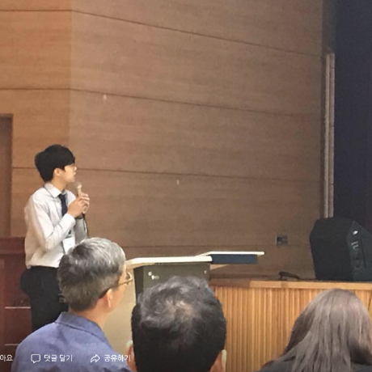

## About Me

I obtained a Master Degree in computer science from the Korea University with a focus on a NLP such as dialog system and sequence labeling problems. My advisor is Prof. <a href="https://scholar.google.co.kr/citations?user=HMTkz7oAAAAJ&amp;hl=ko&amp;oi=ao">Heuiseok Lim</a>. After MS degree, I'm working at Kakao corporation.

 <!-- This is a jekyll based resume template. You can find the full source code on [GitHub] --> 
 <!-- (https://github.com/bk2dcradle/researcher) -->
[*Google Scholar*](https://scholar.google.com/citations?user=Pz8yVqYAAAAJ&hl=en)

## Research Interest

Dialogue System, Quantitative analysis

## Publications
1. An Effective Domain Adaptive Post-Training Method for BERT in Response Selection 
Taesun Whang, **Dongyub Lee**, Chanhee Lee, Kisu Yang, Dongsuk Oh, HeuiSeok Lim 
[*Interspeech, 2020*](https://arxiv.org/abs/1908.04812v2)

2. Reference and Document Aware Semantic Evaluation Methods for Korean Language Summarization 
**Dongyub Lee**, Myeongcheol Shin, Taesun Whang, Seungwoo Cho, Byeongil Ko, Daniel Lee, Eunggyun Kim, Jaechoon Jo 
[*arXiv preprint*](https://arxiv.org/abs/2005.03510)

3. Integrating breakdown detection into dialogue systems to improve knowledge management: encoding temporal utterances with memory attention 
SEOLHWA LEE, **DONGYUB LEE**, DANIAL, HOOSHYAR JAECHOON JO, HEUISEOK LIM  
[*INFORMATION TECHNOLOGY AND MANAGEMENT-2019 (SCIE)*](https://link.springer.com/article/10.1007/s10799-019-00308-x)

4. EmotionX-KU: BERT-Max based Contextual Emotion Classifier 
Kisu Yang, **Dongyub Lee**, Taesun Whang, Seolhwa Lee, Heuiseok Lim 
[*IJCAI 2019 Workshop on the 7th Natural Language Processing for Social Media (Shared Task, EmotionX), 2019, Macau.*](https://arxiv.org/pdf/1906.11565.pdf) 

5. Domain Adaptive Training BERT for Response Selection 
Taesun Whang, **Dongyub Lee**, Chanhee Lee, Kisu Yang, Dongsuk Oh, HeuiSeok Lim 
[*arXiv preprint*](https://arxiv.org/pdf/1908.04812.pdf)

6. Enhanced Sequential Representation Augmented with Utterance-level Attention for Response Selection 
Taesun Whang, **Dongyub Lee**, Chanhee Lee, Heuiseok Lim 
[*AAAI 2019 Workshop on Dialogue System Technology Challenges 7 (DSTC7), 2019, Hawaii, USA.*](http://workshop.colips.org/dstc7/papers/15.pdf)

7. Character-Level Feature Extraction with Densely Connected Networks 
Chanhee Lee, Young-Bum Kim, **Dongyub Lee**, Heuiseok Lim 
[*COLING 2018*](https://www.semanticscholar.org/paper/Character-Level-Feature-Extraction-with-Densely-Lee-Kim/2cf7fb912fb61066668cb6088f45ffbb16e2df03)

## Domestic Publications in Korean
1. Adversarial Learning for Natural Language Understanding 
**이동엽**, 황태선, 이찬희, 임희석 
[*한글 및 한국어 정보처리-2018*]

2. Attention 기반의 대화 발화 예측 모델 
황태선, **이동엽**, 이찬희, 임희석 
[*한글 및 한국어 정보처리-2018*] 

3. Bi-directional LSTM-CNN-CRF for Korean Named Entity Recognition System with Feature Augmentation 
**이동엽**, 유원희, 임희석 
[*한국융합학회논문지제 8권, 제 12호, pp.39-47, 2017.12*]

4. 도메인 특정 지식을 결합한 End-to-End Learning 방식의 한국어 식당 예약 대화 시스템 모델 개발 
**이동엽**, 김경민, 임희석 
[*한글 및 한국어 정보처리-2017*]

5. 식당 예약 대화 시스템 개발을 위한 한국어 데이터셋 구축 
김경민, **이동엽**, 임희석 
[*한글 및 한국어 정보처리-2017*]

6. End-to-end learning을 이용한 한국어 단문 응답 시스템 개발  
**이동엽**, 임희석 
[*KCC-2017*]

7. User Sentiment Analysis on Amazon Fashion Product Review Using Word Embedding 
**이동엽**, 조재춘, 임희석 
[*한국융합학회논문지, 제8권, 제4호, pp.1-8, 2017.04*]

8. CNN based feature augmentation for SVM classifier 
**이동엽**, 남상협, 나승훈 
[*KCC-2016*]

## Honors & Awards

Year | Award
:-----:|-------
2019 | 2nd place in the EmotionX (shared task of SocialNLP), IJCAI 2019   
2019 | Fourth place in the DSTC-7 tack-1 task, AAAI 2019
2018 | 국어정보처리 경진대회 동상 (Dependency Parser), 한글 및 한국어 정보처리
2018 | 카카오 연구 장학생
2017 | 국어정보처리 경진대회 금상 (Named Entity Recoginition), 한글 및 한국어 정보처리 
2016 | 소프트웨어 마에스트로 6기 (1단계 수료, 2단계 진출)
2015 | 인하 스타트업 경진대회 동상
2014 | 인하대학교 컴퓨터공학과 프로그래밍 공모전 2위

 <!-- This is a [link](http://google.com). Something *italics* and something **bold**.-->
 <!-- Here is a horizontal rule --- -->
 <!-- Here is a blockquote> To a great mind, nothing is little -->
