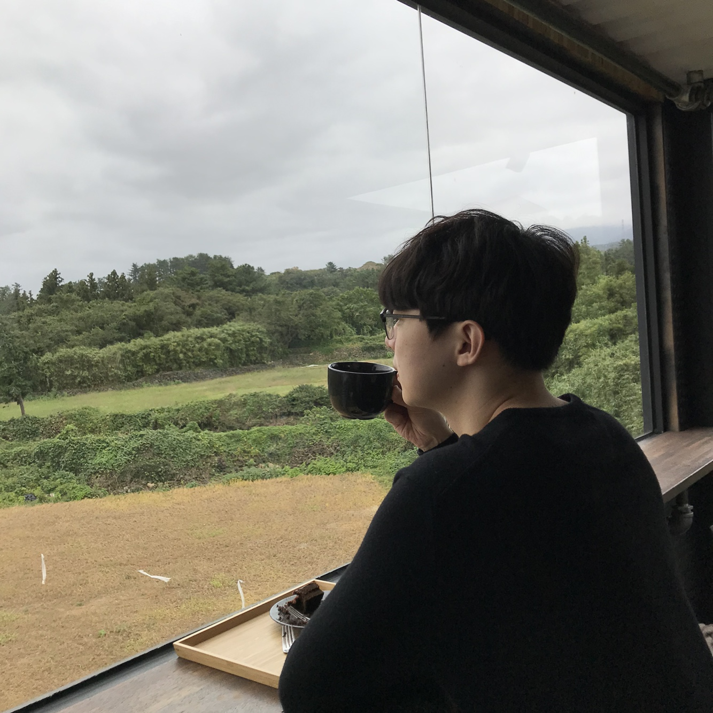

## About Me

I obtained a Master’s Degree in computer science from the Korea University. My advisor is Prof. <a href="https://scholar.google.co.kr/citations?user=HMTkz7oAAAAJ&amp;hl=ko&amp;oi=ao">Heuiseok Lim</a>. Currently, I’m working at Kakao corporation focusing on dialogue and summarization systems.

**[Google Scholar]**: [*link*](https://scholar.google.com/citations?user=Pz8yVqYAAAAJ&hl=en)

**[Linkdin]**:[*link*](https://www.linkedin.com/in/dongyub-lee-56a65810a/)

## Research Interest
Dialogue System, Summarization

## Academic Activities
- Reviewer of ACL 2021 and EMNLP 2021.

## News
* Oct 2021: In the Dialogue State Tracking Challenge (DSTC 10) Track2, we achieved 3rd place in Task1 and 5th place in Task2 [DSTC10](https://dstc10.dstc.community/home). 
* SEP 2021: Our paper on dialogue summarization got accepted to [NewSum, EMNLP 2021](https://aclanthology.org/2021.newsum-1.8/). 
* JUN 2021: Our paper on disfluency detection got accepted to [INTERSPEECH 2021](https://www.interspeech2021.org/). 
* MAY 2021: Our paper on aspect-based sentiment analysis ([DCRAN](https://aclanthology.org/2021.acl-short.63.pdf)) got accepted to [ACL 2021](https://2021.aclweb.org/). 
* DEC 2020: Our paper on multi-turn dialog system ([UMS](https://arxiv.org/pdf/2009.04703.pdf)) got accepted to [AAAI 2021](https://aaai.org/Conferences/AAAI-21/). 
* OCT 2020: Our paper on summarization ([RDASS](https://www.aclweb.org/anthology/2020.coling-main.491.pdf)) got accepted to [COLING 2020](https://coling2020.org/). 
<!--* JUL 2020: Our paper on multi-turn dialog system got accepted to [INTERSPEECH 2020](http://www.interspeech2020.org/). -->
<!--* AUG 2019: Our system ranked 2nd place at [EmotionX](https://sites.google.com/view/emotionx2019/) (shared task of [SocialNLP@IJCAI2019](https://sites.google.com/site/socialnlp2019/)). -->

## International Publications

**[2021]**

Capturing Speaker Incorrectness: Speaker-Focused Post-Correction for Abstractive Dialogue Summarization  
**Dongyub Lee**, Jungwoo Lim, Taesun Whang, chanhee lee, Seungwoo Cho, Mingun Park and Heuiseok Lim  
[*NewSum, EMNLP 2021*](https://aclanthology.org/2021.newsum-1.8/)

Auxiliary Sequence Labeling Tasks for Disfluency Detection  
**Dongyub Lee**, Byeongil Ko, Myeong Cheol Shin, Taesun Whang, Daniel Lee, Eun Hwa Kim, EungGyun Kim, Jaechoon Jo  
[*INTERSPEECH 2021*](https://arxiv.org/abs/2011.04512)

Deep Context- and Relation-Aware Learning for Aspect-based Sentiment Analysis  
{Shinhyeok Oh, **Dongyub Lee}***, Taesun Whang, IlNam Park, Gaeun Seo, EungGyun Kim, Harksoo Kim [*equal contribution]  
[*ACL 2021 (main)*](http://arxiv.org/abs/2106.03806)

Do Response Selection Models Really Know What’s Next? Utterance Manipulation Strategies for Multi-turn Response Selection  
Taesun Whang*, **Dongyub Lee***, Dongsuk Oh, Chanhee Lee, Kijong Han, Dong-hun Lee, Saebyeok Lee [*equal contribution]  
[*AAAI 2021*](https://arxiv.org/abs/2009.04703)

**[2020]**

Reference and Document Aware Semantic Evaluation Methods for Korean Language Summarization 
**Dongyub Lee**, Myeongcheol Shin, Taesun Whang, Seungwoo Cho, Byeongil Ko, Daniel Lee, Eunggyun Kim, Jaechoon Jo 
[*COLING 2020*](https://www.aclweb.org/anthology/2020.coling-main.491/)

An Effective Domain Adaptive Post-Training Method for BERT in Response Selection 
Taesun Whang, **Dongyub Lee**, Chanhee Lee, Kisu Yang, Dongsuk Oh, HeuiSeok Lim 
[*Interspeech 2020*](https://arxiv.org/abs/1908.04812v2)

Development of Fashion Product Retrieval and Recommendations Model Based on Deep Learning 
Jaechoon Jo, Seolhwa Lee, Chanhee Lee, **Dongyub Lee**, Heuiseok Lim 
[*Electronics 9.3 (Mar. 2020) p. 508. Multidisciplinary Digital Publishing Institute, 2020.*](https://www.mdpi.com/2079-9292/9/3/508)

**[2019]**

Integrating breakdown detection into dialogue systems to improve knowledge management: encoding temporal utterances with memory attention 
SEOLHWA LEE, **DONGYUB LEE**, DANIAL, HOOSHYAR JAECHOON JO, HEUISEOK LIM  
[*INFORMATION TECHNOLOGY AND MANAGEMENT-2019 (SCIE)*](https://link.springer.com/article/10.1007/s10799-019-00308-x)

EmotionX-KU: BERT-Max based Contextual Emotion Classifier 
Kisu Yang, **Dongyub Lee**, Taesun Whang, Seolhwa Lee, Heuiseok Lim 
[*IJCAI 2019 Workshop on the 7th Natural Language Processing for Social Media (Shared Task, EmotionX), 2019, Macau.*](https://arxiv.org/pdf/1906.11565.pdf) 

Enhanced Sequential Representation Augmented with Utterance-level Attention for Response Selection 
Taesun Whang, **Dongyub Lee**, Chanhee Lee, Heuiseok Lim 
[*AAAI 2019 Workshop on Dialogue System Technology Challenges 7 (DSTC7), 2019, Hawaii, USA.*](http://workshop.colips.org/dstc7/papers/15.pdf)

**[2018]**

Character-Level Feature Extraction with Densely Connected Networks 
Chanhee Lee, Young-Bum Kim, **Dongyub Lee**, Heuiseok Lim 
[*COLING 2018*](https://www.aclweb.org/anthology/C18-1273/)

## Domestic Publications
1. Adversarial Learning for Natural Language Understanding 
**Dongyub Lee**, Taesun Whang, Chanhee Lee, Heuiseok Lim 
[*HCLT-2018*]

2. Attention-based Next Utterance Classification in Dialogue System  
Taesun Whang, **Dongyub Lee**, Chanhee Lee, Heuiseok Lim 
[*HCLT 2018*] 

3. Bi-directional LSTM-CNN-CRF for Korean Named Entity Recognition System with Feature Augmentation 
**Dongyub Lee**, WonHui Yu, Heuiseok Lim 
[*Journal of the Korea Convergence Society Volume 8 Issue 12, pp.55-62, 2017.12*]

4. Development of a Dialogue System Model for Korean Restaurant Reservation with End-to-End Learning Method Combining Domain Specific Knowledge  
**Dongyub Lee**, Gyeongmin Kim, Heuiseok Lim 
[*HCLT-2017*]

5. Development of Korean Dialogue Dataset for Restaurant Reservation System  
Gyeongmin Kim, **Dongyub Lee**, Heuiseok Lim 
[*HCLT-2017*]

6. A Development of Korean Short Message Response System Based on End-to-end Learning  
**Dongyub Lee**, Heuiseok Lim 
[*KCC-2017*]

7. User Sentiment Analysis on Amazon Fashion Product Review Using Word Embedding 
**Dongyub Lee**, Jaechoon Jo, Heuiseok Lim 
[*Journal of the Korea Convergence Society, 제8권, 제4호, pp.1-8, 2017.04*]

8. CNN based feature augmentation for SVM classifier 
**Dongyub Lee**, Namsang Hyup, SeungHoon Na 
[*KCC-2016*]

## Appointments & Awards

Year | Award
:-----:|-------
2021 | 3rd place in Task1 and 5th place in Task2, Dialogue State Tracking Challenge (DSTC 10) Track2, AAAI 2022
2019 | 2nd place in the EmotionX (shared task of SocialNLP), IJCAI 2019   
2019 | Fourth place in the DSTC-7 tack-1 task, AAAI 2019
2018 | Bronze Prize in the Korean Language Information Processing Competition (Dependency Parser), HCLT 2018
2018 | Kakao Research Scholarship
2017 | Gold Prize in Korean Language Information Processing Competition (Named Entity Recoginition), HCLT 2017
2016 | Software Maestro 6th (Completion of Phase 1, Advance to Phase 2)

 <!-- This is a [link](http://google.com). Something *italics* and something **bold**.-->
 <!-- Here is a horizontal rule --- -->
 <!-- Here is a blockquote> To a great mind, nothing is little -->
